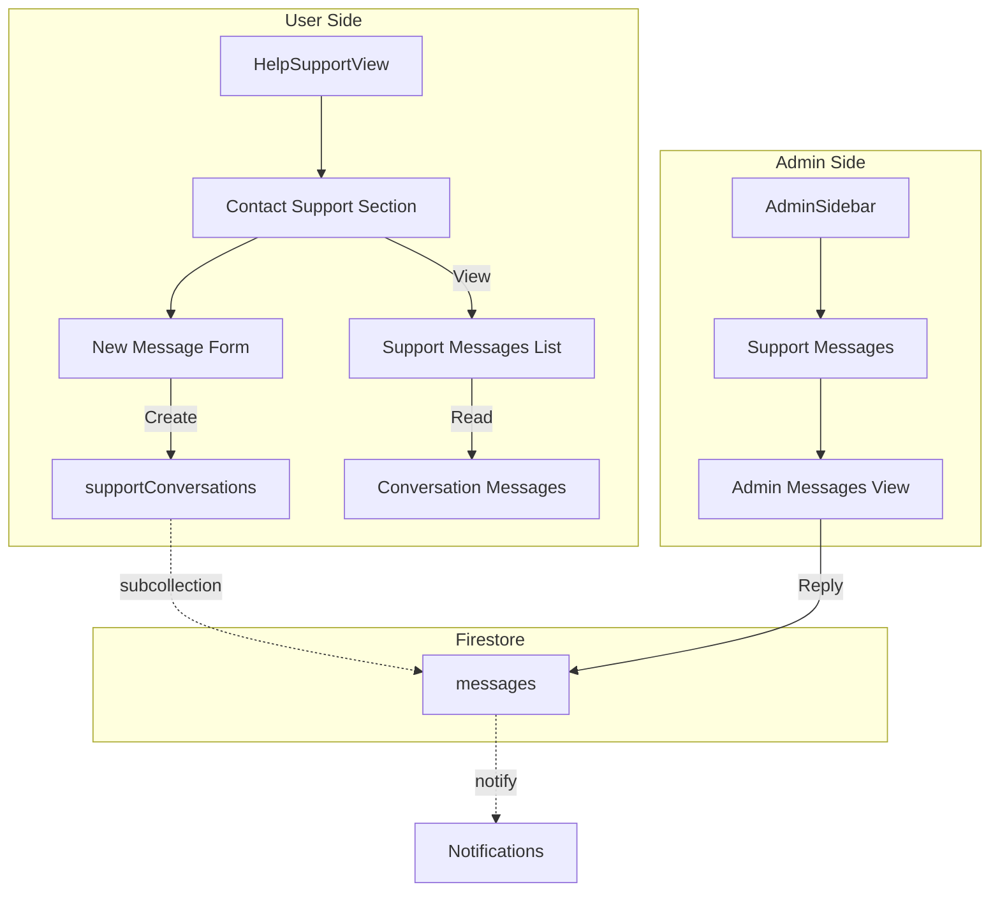

# In-App Admin Messaging Plan

## Executive Summary

This document outlines the implementation plan for allowing users to send messages to the app admin directly through the GetGo app. Currently, users can only contact support via email (`support@getgo.ph`). This feature will enable real-time in-app messaging between users and administrators.

---

## Current Architecture Analysis

### Existing Components

| Component | Location | Purpose |
|-----------|----------|---------|
| HelpSupportView | `frontend/src/views/HelpSupportView.jsx` | FAQ, Getting Started, Contact (email only) |
| ChatModal | `frontend/src/components/modals/ChatModal.jsx` | Bid-related messaging between users |
| AdminSidebar | `frontend/src/components/admin/AdminSidebar.jsx` | Admin navigation (no support section) |
| Firestore Rules | `firestore.rules` | Security rules for all collections |

### Existing Data Flow

1. **User Help**: `HelpSupportView` → Shows FAQ, email contact
2. **User-to-User Chat**: `ChatModal` → Uses `/bids/{bidId}/messages` subcollection
3. **Admin Panel**: `AdminDashboard` → Various management sections

---

## Proposed Architecture

### Data Model

#### Collection: `supportConversations`

```javascript
{
  id: string,                    // Auto-generated document ID
  userId: string,                // User who initiated the conversation
  userName: string,              // User's display name
  userRole: string,              // 'shipper' | 'trucker' | 'broker'
  status: string,                // 'open' | 'pending' | 'resolved' | 'closed'
  subject: string,                // Initial subject/category
  lastMessage: string,            // Preview of last message
  lastMessageAt: timestamp,      // For sorting
  lastMessageSenderId: string,   // Who sent the last message
  unreadCount: number,           // Unread count for user
  adminUnreadCount: number,      // Unread count for admin
  createdAt: timestamp,
  updatedAt: timestamp,
  resolvedAt: timestamp | null,
  resolvedBy: string | null       // Admin UID who resolved
}
```

#### Subcollection: `supportConversations/{conversationId}/messages`

```javascript
{
  id: string,                    // Auto-generated message ID
  senderId: string,              // User UID or 'admin'
  senderName: string,             // Display name
  senderRole: string,             // 'user' | 'admin'
  message: string,                // Message content
  isRead: boolean,               // Read status
  createdAt: timestamp,
  updatedAt: timestamp
}
```

### Mermaid Diagram: Data Flow



---

## Implementation Steps

### Phase 1: Backend (Firestore)

#### Step 1.1: Add Firestore Security Rules

Add rules for `supportConversations` collection in [`firestore.rules`](firestore.rules):

```javascript
// Support Conversations
match /supportConversations/{conversationId} {
  allow read: if isOwner(resource.data.userId) || isAdmin();
  allow create: if isAuth() 
    && request.resource.data.userId == request.auth.uid
    && request.resource.data.userName is string
    && request.resource.data.status == 'open';
  allow update: if isOwner(resource.data.userId) || isAdmin();
  allow delete: if false;
  
  // Messages subcollection
  match /messages/{messageId} {
    allow read: if isOwner(get(/databases/$(database)/documents/supportConversations/$(conversationId)).data.userId) || isAdmin();
    allow create: if isAuth() 
      && request.resource.data.senderId == request.auth.uid
      && request.resource.data.message is string
      && request.resource.data.message.size() > 0
      && request.resource.data.message.size() <= 5000;
    allow update: if isAdmin() 
      && request.resource.data.diff(resource.data).affectedKeys().hasOnly(['isRead', 'updatedAt']);
    allow delete: if false;
  }
}
```

#### Step 1.2: Add Firestore Indexes

Add to [`firestore.indexes.json`](firestore.indexes.json):

```json
{
  "collectionGroup": "supportConversations",
  "queryScope": "COLLECTION",
  "fields": [
    { "fieldPath": "userId", "order": "ASCENDING" },
    { "fieldPath": "updatedAt", "order": "DESCENDING" }
  ]
},
{
  "collectionGroup": "supportConversations",
  "queryScope": "COLLECTION",
  "fields": [
    { "fieldPath": "status", "order": "ASCENDING" },
    { "fieldPath": "updatedAt", "order": "DESCENDING" }
  ]
},
{
  "collectionGroup": "messages",
  "queryScope": "COLLECTION",
  "fields": [
    { "fieldPath": "createdAt", "order": "DESCENDING" }
  ]
}
```

---

### Phase 2: User Interface

#### Step 2.1: Create Support Message Service

Create [`frontend/src/services/supportMessageService.js`](frontend/src/services/supportMessageService.js):

- `createConversation(userId, userName, userRole, subject)` - Start new conversation
- `sendMessage(conversationId, userId, userName, message)` - Send message
- `getUserConversations(userId)` - Get all user's conversations
- `getConversationMessages(conversationId)` - Get messages in a conversation
- `markAsRead(conversationId, userId)` - Mark messages as read
- `updateConversationStatus(conversationId, status)` - Update status

#### Step 2.2: Modify HelpSupportView

Update [`frontend/src/views/HelpSupportView.jsx`](frontend/src/views/HelpSupportView.jsx):

1. Replace static "Contact Support" section with interactive messaging
2. Add "Chat Admin" option in the menu
3. Create sub-components:
   - `SupportConversationsList` - List user's conversations
   - `SupportConversationView` - Individual conversation with admin
   - `NewSupportMessageForm` - Form to start new conversation

#### Step 2.3: Add Support Category Selection

Categories for support:
- Account Issues
- Payment Problems
- Contract Questions
- Technical Support
- Bug Report
- Other

---

### Phase 3: Admin Interface

#### Step 3.1: Create Admin Support Messages View

Create [`frontend/src/views/admin/SupportMessagesView.jsx`](frontend/src/views/admin/SupportMessagesView.jsx):

Features:
- List all support conversations with filters (open, pending, resolved)
- Search by user name or conversation ID
- View conversation details and message history
- Reply to user messages
- Mark conversation as resolved
- User profile quick view

#### Step 3.2: Update Admin Sidebar

Update [`frontend/src/components/admin/AdminSidebar.jsx`](frontend/src/components/admin/AdminSidebar.jsx):

Add new nav item:
```javascript
{ id: 'support', label: 'Support Messages', icon: MessageCircle, badge: 'openSupportTickets' }
```

#### Step 3.3: Export and Register View

Update [`frontend/src/views/admin/index.js`](frontend/src/views/admin/index.js):

```javascript
export { SupportMessagesView } from './SupportMessagesView';
```

#### Step 3.4: Update AdminDashboard Routing

Update [`frontend/src/views/admin/AdminDashboard.jsx`](frontend/src/views/admin/AdminDashboard.jsx):

1. Import the SupportMessagesView:
```javascript
import { SupportMessagesView } from './SupportMessagesView';
```

2. Add case in the switch statement:
```javascript
case 'support':
  return <SupportMessagesView />;
```

3. Pass badges prop to AdminSidebar (add openSupportTickets to badge counts)

---

### Phase 4: Notifications

#### Step 4.1: User Notifications

When admin replies to a user:
- Create notification in `users/{userId}/notifications`
- Notification type: `support_reply`
- Include conversation ID for deep linking

#### Step 4.2: Admin Notifications

When user creates new conversation or replies:
- Add to admin dashboard badge count
- Optional: Email notification for urgent issues

---

## File Changes Summary

| File | Action | Description |
|------|--------|-------------|
| `firestore.rules` | Modify | Add supportConversations rules |
| `firestore.indexes.json` | Modify | Add support message indexes |
| `frontend/src/services/supportMessageService.js` | Create | New service for support messages |
| `frontend/src/views/HelpSupportView.jsx` | Modify | Add messaging UI |
| `frontend/src/views/admin/SupportMessagesView.jsx` | Create | Admin conversation management |
| `frontend/src/views/admin/index.js` | Modify | Export new view |
| `frontend/src/components/admin/AdminSidebar.jsx` | Modify | Add Support nav item |
| `frontend/src/views/admin/AdminDashboard.jsx` | Modify | Add SupportMessagesView routing and import |

---

## UI/UX Considerations

### User Side (HelpSupportView)

1. **Main Menu**: Add "Chat Admin" card alongside existing options
2. **Conversation List**: Show subject, last message preview, timestamp, status badge
3. **Chat Interface**: Similar to ChatModal but for admin communication
4. **New Message**: Subject dropdown + message textarea + send button

### Admin Side

1. **Inbox View**: Table/list with columns - User, Subject, Status, Last Activity, Actions
2. **Conversation Panel**: Split view - conversation list on left, messages on right
3. **Quick Actions**: Reply button, Resolve button, Mark as urgent
4. **Filters**: Status filter (All, Open, Pending, Resolved), Date range

---

## Security Considerations

1. **User Isolation**: Users can only see their own conversations
2. **Message Validation**: Max 5000 characters per message
3. **Admin Access**: Only users with admin role can reply
4. **No Delete**: Conversations cannot be deleted, only resolved/closed

---

## Testing Plan

1. **User Flow Test**:
   - Navigate to Help & Support
   - Start new support conversation
   - Send messages
   - Receive admin reply

2. **Admin Flow Test**:
   - View new support conversations
   - Reply to user messages
   - Resolve conversations

3. **Security Test**:
   - Verify users cannot access other users' conversations
   - Verify non-admin cannot access admin features

---

## Additional Considerations

### Real-time Updates
- Use Firestore `onSnapshot` for real-time message updates (similar to existing `useChat` hook)
- Implement proper cleanup of subscriptions when components unmount

### User Context
- The service needs access to current user's profile (userId, userName, userRole)
- Can be obtained from the existing `useAuth` hook
- Admin replies should include admin display name from auth context

### Edge Cases
- Handle empty conversation list (show helpful empty state)
- Handle very long messages (truncate in preview, show full in detail)
- Handle network errors gracefully with retry options
- Handle conversation status changes (user cannot reopen resolved conversations)

### Deep Linking
- Support direct links to specific support conversations
- Consider URL params for HelpSupportView to support deep linking

---

## Validation Checklist

- [x] Data model defined with all required fields
- [x] Firestore security rules specified
- [x] Firestore indexes specified
- [x] User interface changes documented
- [x] Admin interface changes documented
- [x] Notification system documented
- [x] File changes summarized
- [x] UI/UX considerations included
- [x] Security considerations included
- [x] Testing plan included
- [x] AdminDashboard routing included
- [x] Additional edge cases considered
