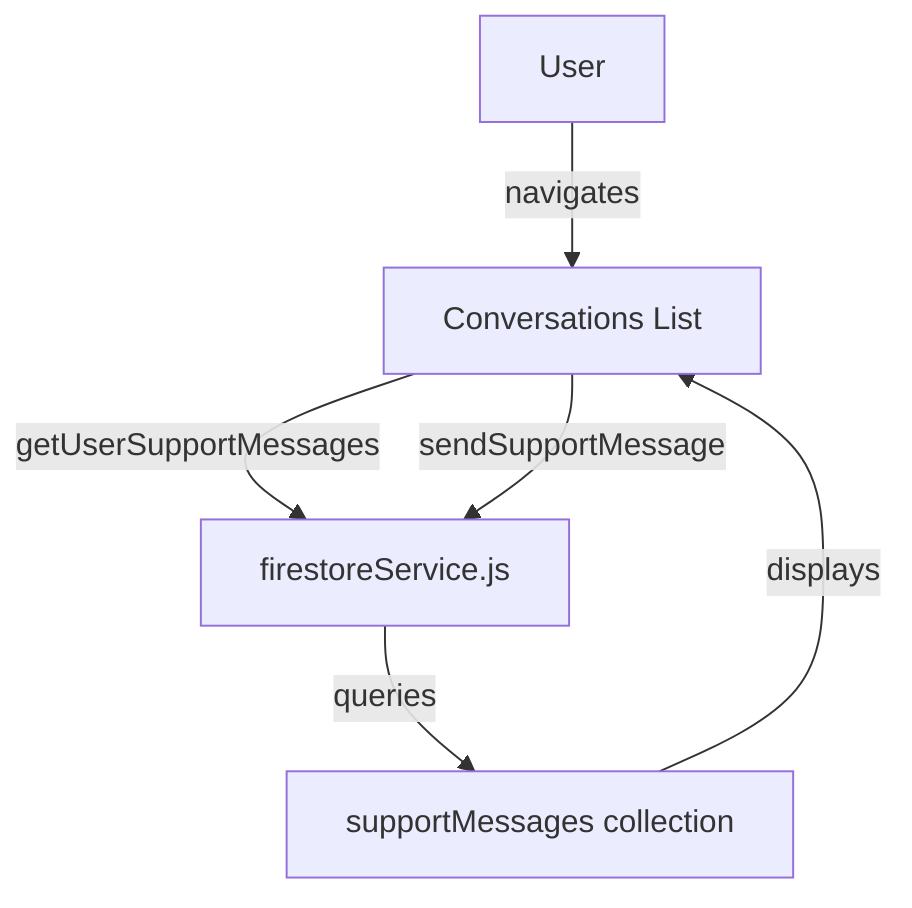

# Support Messages Blank Issue - Investigation & Fix Plan

## Summary

The message tab (MessagesView.jsx) is showing blank/empty - no messages are showing. After thorough investigation of the codebase, I've identified the root causes and created a comprehensive fix plan.

## Current System Architecture



## Root Cause Analysis

### Issue 1: Error State Set But Never Displayed (BUG!)
**Location**: `MessagesView.jsx` lines 173 and 191

```javascript
const [error, setError] = useState(null);  // Line 173
// ...
setError('Failed to load messages');  // Line 191 - error is set
// ...
// BUT THE ERROR IS NEVER DISPLAYED IN THE JSX!
```

The error state is defined and set, but there's NO UI component that displays the error message to the user!

### Issue 2: Potential Null Errors in Filtering
**Location**: `MessagesView.jsx` lines 214-217

```javascript
const filteredConversations = useMemo(() => {
  return conversations.filter(conv => {
    const matchesSearch = conv.message.toLowerCase().includes(searchTerm.toLowerCase()) ||
                         conv.category.toLowerCase().includes(searchTerm.toLowerCase());
```

If `conv.message` or `conv.category` is undefined/null, this will throw an error and crash the app.

### Issue 3: Firestore Composite Index Required
**Location**: `firestoreService.js` line 977-982

```javascript
const q = query(
  collection(db, 'supportMessages'),
  where('userId', '==', userId),
  orderBy('createdAt', 'desc'),  // This requires a composite index!
  limit(limit_count)
);
```

This composite query requires a Firestore index. While defined in `firestore.indexes.json`, if it's not deployed, the query will fail silently or throw an error.

## Fix Plan

### Step 1: Add Error Display to MessagesView.jsx

Add error UI after the loading state (around line 248):

```jsx
{error && (
  <div className="mb-4 p-4 rounded-xl bg-red-50 dark:bg-red-900/20 border border-red-200 dark:border-red-800">
    <p className="text-sm text-red-600 dark:text-red-400">{error}</p>
    <button 
      onClick={loadConversations}
      className="mt-2 text-sm text-orange-600 hover:text-orange-500 font-medium"
    >
      Try Again
    </button>
  </div>
)}
```

### Step 2: Add Defensive Null Checks

Update the filtering logic (lines 214-217):

```javascript
const filteredConversations = useMemo(() => {
  return conversations.filter(conv => {
    const convMessage = conv.message || '';
    const convCategory = conv.category || '';
    const matchesSearch = convMessage.toLowerCase().includes(searchTerm.toLowerCase()) ||
                         convCategory.toLowerCase().includes(searchTerm.toLowerCase());
    const matchesStatus = statusFilter === 'all' || conv.status === statusFilter;
    return matchesSearch && matchesStatus;
  }).sort((a, b) => {
    const aLatest = a.replies?.length > 0 ? a.replies[a.replies.length - 1].createdAt : a.createdAt;
    const bLatest = b.replies?.length > 0 ? b.replies[b.replies.length - 1].createdAt : b.createdAt;
    return new Date(bLatest) - new Date(aLatest);
  });
}, [conversations, searchTerm, statusFilter]);
```

### Step 3: Add Console Logging for Debugging

Add logging in loadConversations function:

```javascript
const loadConversations = async () => {
  try {
    setLoading(true);
    console.log('[MessagesView] Loading conversations for user:', currentUser.uid);
    const messages = await getUserSupportMessages(currentUser.uid, 100);
    console.log('[MessagesView] Loaded messages:', messages.length);
    setConversations(messages);
  } catch (err) {
    console.error('[MessagesView] Error loading conversations:', err);
    setError('Failed to load messages: ' + err.message);
  } finally {
    setLoading(false);
  }
};
```

## Implementation Tasks

1. **Modify MessagesView.jsx**:
   - Add error UI component to display the error state
   - Add defensive null checks in filtering logic
   - Add console logging for debugging
   - Add empty state with better UX when no messages exist

2. **Verify Firestore Index**:
   - Ensure the composite index for `supportMessages` (userId + createdAt) is deployed
   - Check Firebase console for any index-related errors

3. **Test the Fix**:
   - Navigate to Messages tab
   - Verify error messages display if there's an issue
   - Test sending a new message
   - Verify conversations appear correctly

## Files to Modify

| File | Changes |
|------|---------|
| `frontend/src/views/MessagesView.jsx` | Add error display UI, defensive null checks, console logging |

## Quick Summary

The main bug is that **MessagesView.jsx sets an error state but never displays it**. When the Firestore query fails (likely due to missing composite index), users see a blank screen with no explanation. The fix is to:

1. Display the error state in the UI
2. Add null checks to prevent crashes
3. Add debugging logs
